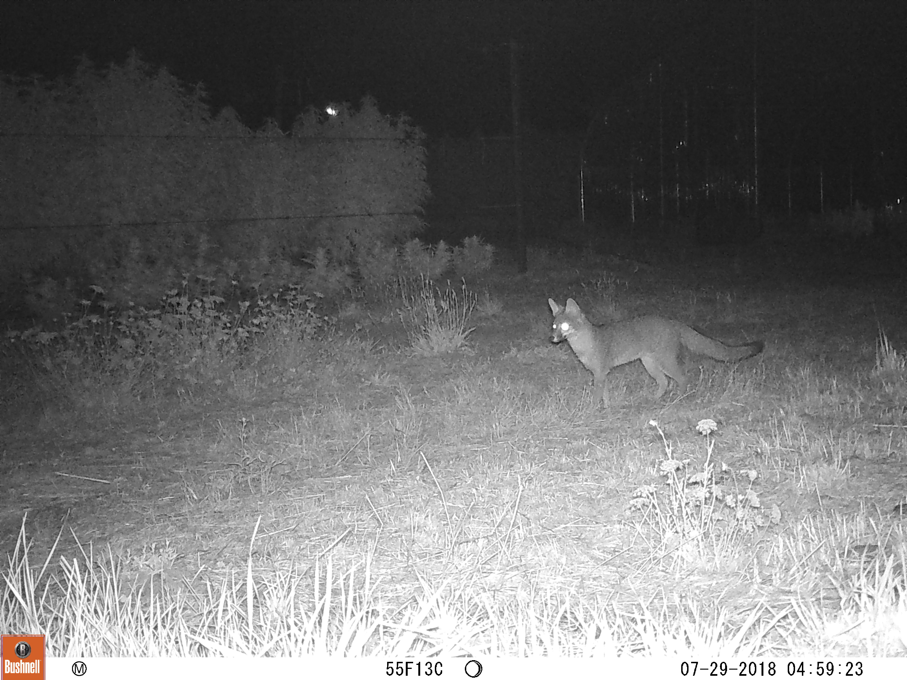

###*Cannabis agriculture in the Western US is a booming economy. However, it is also a massively understudied topic of research given its illicit history. Working with local cannabis farmers and community members, I am researching the effects of the industry and specific land use practices on wildlife in order to inform sustainable agricultural practices.*

####Why study cannabis? 
Studying cannabis is important if we want policies and land use decisions that are informed by science. Unfortunately, because of cannabis’ federal illegal status as a Schedule I drug, there has been very little research on its effects on the environment. Despite rumors of a collapsing industry, cannabis seems to be here to stay, so researching the effects of the industry provides an opportunity to inform its future trajectory.

It is also important to study cannabis because it is a unique crop. The policies, culture, and history surrounding cannabis, far more than any qualities of the plant itself, have shaped the ways in which it is grown so that it stands apart as both more industrialized in practice and more parceled into many smaller farms. (link to Van’s study)

My dissertation research involves mapping cannabis production over time from Google Earth images. I combine these maps with wildlife monitoring data that I collect in partnership with land owners and cannabis farmers. 

Photo of a grey fox taken by a camera trap on partner farm [East Fork Cultivars](http://www.eastforkcultivars.com/)
